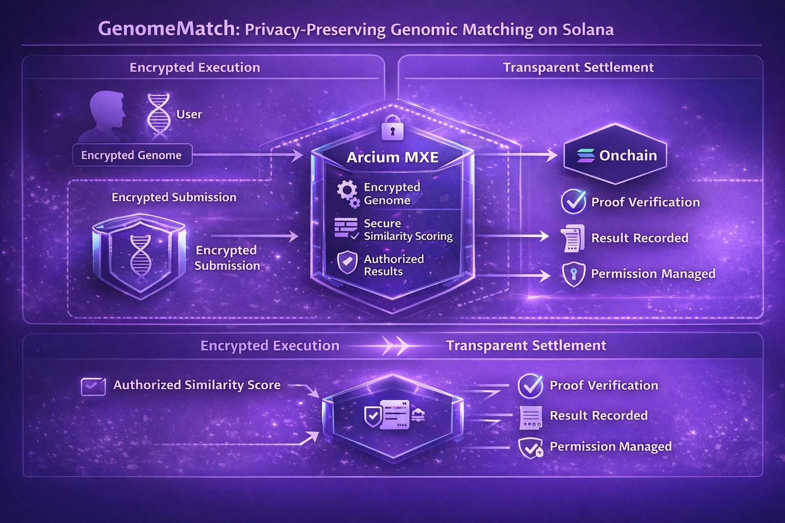
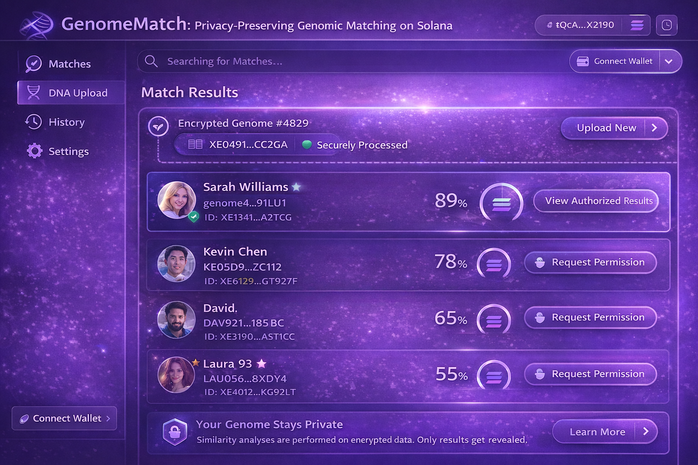

# GenomeMatch (Solana + Arcium)

> GenomeMatch explores how encrypted computation enables genomic matching without exposing raw DNA data.

Genomic matching provides powerful insights but requires exposing extremely sensitive data.

Traditional genomic platforms require users to upload their raw genome sequences, which creates major privacy risks.

GenomeMatch proposes a different model.

Genomes remain encrypted.
Similarity calculations run inside Arcium MXE.
Only authorized similarity results are revealed.

---

## Problem

Genomic data is among the most sensitive data a person can have.

Current matching systems require:

- raw genome uploads
- centralized storage
- trust in data custodians

This creates risks:

- genetic data leaks
- identity exposure
- long-term privacy loss

---

## Solution

GenomeMatch performs similarity analysis on encrypted genomes.

Encrypted:

- raw genome sequence
- genetic markers
- intermediate similarity calculations

Revealed:

- similarity score
- authorized matching results
- verifiable proof

---

## Arcium Integration

Arcium MXE performs:

- encrypted genome comparison
- similarity scoring
- rule-based result authorization

Solana handles:

- proof verification
- result settlement
- permission management

Arcium becomes the confidential compute layer for genomic analysis.

---

## Execution vs Data Exposure

Execution → encrypted genome matching  
Results → authorized outputs only

This allows meaningful genomic insights without exposing raw DNA.

---

## Architecture

---

## Execution Flow

User encrypts genome  
↓  
Encrypted genome submitted  
↓  
Arcium MXE performs similarity computation  
↓  
Authorized similarity score produced  
↓  
Result recorded on Solana

---

## UI Mock

---

## Disclaimer

GenomeMatch is a structural prototype exploring encrypted genomic computation using Arcium.

Not intended for medical use.
